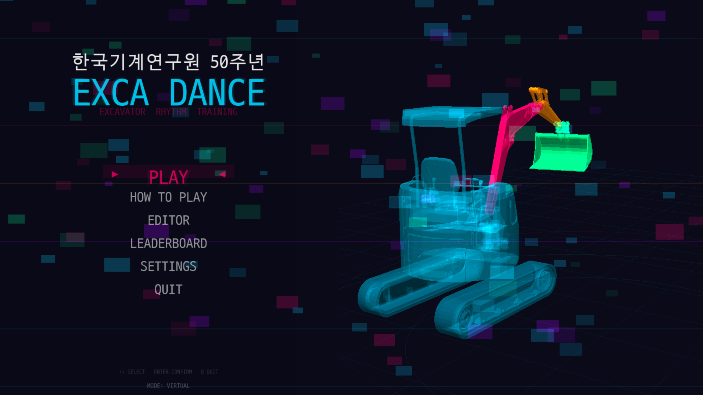
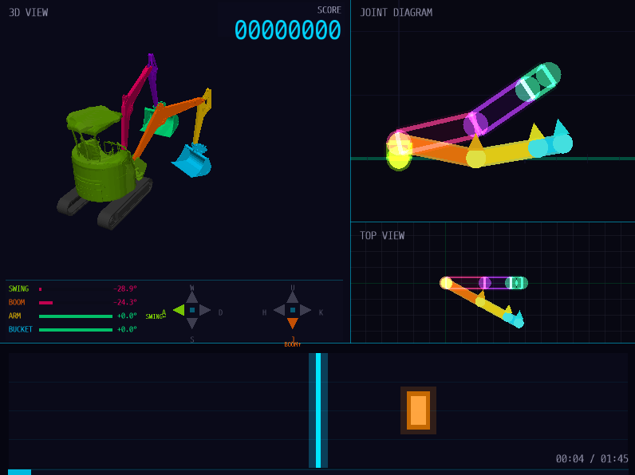

# EXCA DANCE — 원내실증 제출 자료

**한국기계연구원(KIMM) 50주년 기념 · 굴착기 조작 리듬 트레이닝 / 실물 굴착기 원격제어 실증**

| 항목 | 내용 |
|------|------|
| 실증 아이템명 | **EXCA DANCE** (Excavator Rhythm Training) |
| 분류 | 굴착기 4관절 조작 교육용 3D 리듬 게임 + 실물 굴착기 원격제어 실증 |
| 행사 | 한국기계연구원 개원 50주년 기념 행사 |
| 운용 모드 | VIRTUAL(가상 시뮬레이션) / **REAL(ROS2 기반 실물 굴착기 연동)** |
| 제출일 | 2026년 6월 1일 |

---

## 1. 실증 아이템 개요

**EXCA DANCE**는 굴착기의 4개 관절(**선회 swing · 붐 boom · 암 arm · 버킷 bucket**)을 음악 비트에 맞춰 조작하고, 화면에 제시되는 목표 자세(타겟 포즈)와 얼마나 정확히 일치시켰는지를 **각도·타이밍 정확도**로 판정해 점수와 콤보를 부여하는 **3D 리듬 게임**입니다.

그러나 이 아이템의 본질은 단순한 게임이 아니라 **"누구나 게임을 하듯 조작하면, 그 입력이 실시간으로 실물 굴착기를 움직인다"는 원격제어 기술을 공개 현장에서 입증하는 실증 플랫폼**이라는 데 있습니다. 즉, **플레이어는 안전한 게임 인터페이스를 조작하고, 같은 순간 현장의 관람객은 실제 굴착기가 음악에 맞춰 움직이는 장면을 직접 목격**합니다. 이 "조작–구동–관람"의 동시성이 EXCA DANCE를 실증용 콘텐츠로 만든 핵심 이유입니다.

> **한 줄 요약** — "플레이어가 게임을 조작하면 실물 굴착기가 그대로 움직이고, 관람객은 그 실물의 동작을 관람한다. EXCA DANCE는 건설기계 원격제어 기술을, 게임이라는 가장 친숙한 형태로 대중 앞에서 실증하는 플랫폼이다."

---

## 2. 실증 시나리오와 핵심 가치 *(본 아이템이 '실증용'으로 제작된 이유)*

### 2.1 실증 현장 구성 — 하나의 콘텐츠, 두 개의 경험

EXCA DANCE의 실증은 **세 주체가 동시에 연결되는 구조**로 이루어집니다.

```
   [ 플레이어 ]  ──게임 조작(키/패드)──▶  [ 게임 + ROS2 브리지 ]  ──속도 명령──▶  [ 실물 굴착기 ]
        ▲                                                                              │
        │                                  센서 피드백(관절/선회 각도)  ◀───────────────┘
        │
   화면 속 3D·채점에 몰입                                              [ 관람객 ] ──▶ 실물 굴착기의
                                                                                    실제 군무를 관람
```

- **플레이어(능동적 참여자)**: 운전석이 아닌 **안전한 거리의 게임 인터페이스**에서 4관절을 조작하며, 3D 화면·판정·콤보에 몰입합니다.
- **실물 굴착기(실증 대상)**: 플레이어의 입력이 ROS2 속도 명령으로 전달되어 **실제로 비트에 맞춰 움직입니다.**
- **관람객(수동적 관중)**: 게임을 하지 않아도, **실물 중장비가 음악에 맞춰 정밀하게 움직이는 스펙터클**을 눈앞에서 관람합니다.

> 하나의 플레이가 **'게임 화면(플레이어용)'과 '실물 굴착기(관람객용)'라는 두 개의 무대**에서 동시에 펼쳐집니다. 이 이중 경험(dual-surface)이 EXCA DANCE만의 차별점입니다.

### 2.2 실증 시나리오에서의 핵심 장점

1. **안전한 원격제어의 직접 입증** — 플레이어는 위험한 작업 반경 밖, 운전석 탑승 없이 조작합니다. 작업자를 현장 위험으로부터 분리하는 **건설기계 원격·무인화 기술의 안전성**을 행사장에서 그대로 증명합니다.
2. **추상적 기술의 직관적 가시화** — "ROS2 기반 실물 원격제어"라는 전문 기술을, **"내가 게임을 하면 진짜 굴착기가 움직인다"**는 누구나 즉시 이해하는 경험으로 변환합니다. 별도의 설명 없이 기술의 핵심이 전달됩니다.
3. **참여자–관람객 동시 몰입(이중 무대)** — 능동적 플레이어와 수동적 관람객을 **하나의 콘텐츠로 동시에** 사로잡습니다. 줄을 서서 차례를 기다리는 동안에도 관람객은 실물의 동작을 즐기므로, 전시 부스의 체류·집객 효과가 극대화됩니다.
4. **공개 환경에서의 신뢰성 실증** — 통제된 실험실이 아닌 **실제 행사 현장**에서, 실시간 센서 피드백(closed-loop)과 fail-close 안전 게이트로 안정 동작을 입증합니다. 이는 "실환경 검증"이라는 실증(實證)의 본질에 정확히 부합합니다.
5. **교육·홍보·기술 시연의 동시 달성** — 굴착기 조작 원리 학습(교육), 연구원 로봇·자동화 역량 노출(홍보), 원격제어 동작 입증(기술 실증)을 **단일 콘텐츠**로 한 번에 달성합니다.

---

## 3. 기술 설명

### 3.1 조작 및 게임플레이

- **조작 대상**: 굴착기 4관절 — 선회(swing), 붐(boom), 암(arm), 버킷(bucket)
- **관절 가동 범위**: SWING(−180°~180°), BOOM(−52°~13°), ARM(21°~120°), BUCKET(−132°~47°)
- **방식**: 화면 하단 노트 하이웨이를 따라 흐르는 비트에 맞춰, 반투명 "고스트(ghost) 굴착기"가 제시하는 목표 자세로 각 관절을 정렬

### 3.2 채점 · 판정 시스템

- **판정 4단계**: PERFECT / GREAT / GOOD / MISS
- **타이밍 윈도우**: ±35 / 70 / 120 ms (NORMAL 기준)
- **점수 산정**: 기본 점수(300/200/100/0)에 **목표 각도와의 정확도**와 **콤보 배율**을 곱해 합산
- **콤보 배율**: 10콤보 → 2배, 25콤보 → 3배, 50콤보 → 4배 (MISS 시 콤보 0으로 초기화)
- **결과 화면**: 최종 점수, 등급, 판정별 개수, 최대 콤보 제공 및 리더보드 저장

### 3.3 3D 시각화 (렌더링)

- **엔진**: ModernGL(OpenGL) 기반 실시간 3D 렌더링, 네온/사이버펑크 비주얼 테마
- **모델**: STL 메시 기반 굴착기 3D 모델을 순기구학(FK)으로 구동
- **다중 뷰포트**: `3D VIEW`(원근 3D) · `JOINT DIAGRAM`(측면 관절 도식) · `TOP VIEW`(선회 상면도)
- **시각적 가이드**: 목표 자세를 표시하는 고스트 굴착기, 외곽선 강조, 비트 타임라인, 매치율에 따라 색이 변하는 정렬 링(match ring)

### 3.4 실물 굴착기 연동 (ROS2) — *실증 핵심*

- **연동 구조**: 게임 본체와 ROS2 노드를 **별도 프로세스로 분리**하고 IPC 큐로 통신하여 안정성 확보
- **제어 방식**: 실물 모드(REAL)에서 게임은 `/upper_controller/control_cmd`(UpperControlCmd) **속도(velocity) 명령**을 발행하여 실물 굴착기를 구동
- **센서 피드백**: 붐·암·버킷 관절 및 선회 각도 센서 토픽을 구독하여 실물의 실제 자세를 화면에 반영(closed-loop)
- **모드 전환**: VIRTUAL(키보드/게임패드 가상 조작) ↔ REAL(실물 연동)을 설정에서 전환, ROS2 미연결 시 자동으로 가상 모드로 안전 폴백

### 3.5 안전 설계

- **Fail-close 안전 게이트**: 센서 신호가 없거나 일정 시간 이상 지연(stale)되면 명령을 차단
- **관절 한계 보호**: 가동 범위 최소/최대 경계에서 추가로 한계를 벗어나려는 방향의 속도 명령을 차단
- **데드밴드 처리** 및 메뉴·일시정지 시 **무조건 0속도** 송신으로 오작동 방지
- 캘리브레이션 보정(ROS2 원시 각도 ↔ 게임 각도, 속도 보정)으로 실기기 정밀 연동

> 이 안전 설계는 **관람객과 플레이어가 함께 있는 공개 현장에서 실물 중장비를 구동**한다는 실증 환경의 전제 조건을 충족하기 위한 것으로, 기술 시연의 신뢰성을 뒷받침합니다.

---

## 4. 첨부 자료에 대한 간략한 설명

| 구분 | 파일 | 설명 |
|------|------|------|
| 이미지 ① | `01_title.png` | **타이틀 화면** — "한국기계연구원 50주년 EXCA DANCE / EXCAVATOR RHYTHM TRAINING" 로고와 네온 와이어프레임 굴착기, 메인 메뉴(PLAY / HOW TO PLAY / EDITOR / LEADERBOARD / SETTINGS) |
| 이미지 ② | `02_gameplay.png` | **게임플레이 화면** — 좌상단 3D VIEW(굴착기 3D 모델)·우측 JOINT DIAGRAM/TOP VIEW 도식·좌하단 4관절 각도(SWING/BOOM/ARM/BUCKET) 실시간 표시·하단 비트 노트 하이웨이 및 진행도(00:04/01:45) |
| 동영상 | *(별도 첨부)* | 실제 플레이 영상 — 플레이어 조작 화면 및 실물 굴착기 구동/시연 장면 |





**첨부 자료 요약**: 위 캡처 2종은 EXCA DANCE의 타이틀 화면과 플레이어가 보는 실시간 게임플레이 화면입니다. 동영상에는 플레이어의 게임 조작과 더불어 **그 입력에 따라 실제 굴착기가 움직이는 실증 장면**이 담겨 있어, 관람객 관점의 핵심 가치를 함께 확인하실 수 있습니다.

---

## 5. 향후 발전 및 홍보 방안

### 5.1 향후 발전 방안

- **실물 굴착기 원격제어 고도화**: 현재 속도(velocity) 명령 기반 연동을 정밀 자세제어·실시간 피드백까지 확장하여, 게임에서 학습한 조작을 실물 장비로 더욱 정밀하게 전이
- **실증 시연 시나리오 정교화**: 플레이어 조작과 실물 동작이 더 극적으로 동기화되는 시연용 안무(비트맵)를 제작하여 관람객 임팩트 극대화
- **교육 커리큘럼화**: 난이도별 비트맵(연습→숙련) 및 튜토리얼을 체계화하여 신규 작업자 굴착기 조작 **교육·평가 도구**로 활용
- **콘텐츠 저작 도구 확장**: 내장 포즈 에디터를 통해 작업·시연 시나리오별 맞춤 비트맵을 손쉽게 제작
- **안전 운전 훈련 모듈**: 관절 한계·작업 반경 등 안전 제약을 게임 규칙으로 내재화하여 위험 인지 훈련에 적용
- **데이터 기반 평가**: 판정·콤보·정확도 로그를 활용한 조작 숙련도 정량 분석 및 리더보드 기반 동기 부여

### 5.2 홍보 방안

- **체험형 전시 시연**: 개원 50주년 행사를 시작으로 대외 전시·오픈하우스에서 **"게임 조작 → 실물 굴착기 구동"** 체험 부스로 운영하여 연구원의 로봇·자동화 역량을 직관적으로 전달
- **가상–실물 동시 구동 데모**: 화면 속 가상 굴착기와 현장의 실물 굴착기가 같은 동작을 수행하는 장면을 핵심 시연 포인트로 부각하여 ROS2 기반 원격제어 기술을 임팩트 있게 시각화
- **영상 콘텐츠 제작**: 플레이어 조작과 실물 동작을 한 화면에 담은 영상을 홍보 채널(연구원 SNS, 유튜브 등)에 게시하여 대중 친화적 과학기술 콘텐츠로 확산
- **교육·산학 연계**: 건설기계·스마트 건설 분야 교육기관 및 기업과 연계한 체험 프로그램으로 확대

---

## 6. 문의처

- 작성: 한국기계연구원
- 본 자료는 연구실의 연구 기록 및 향후 자산으로 활용됩니다. (제출일: 2026-06-01)
